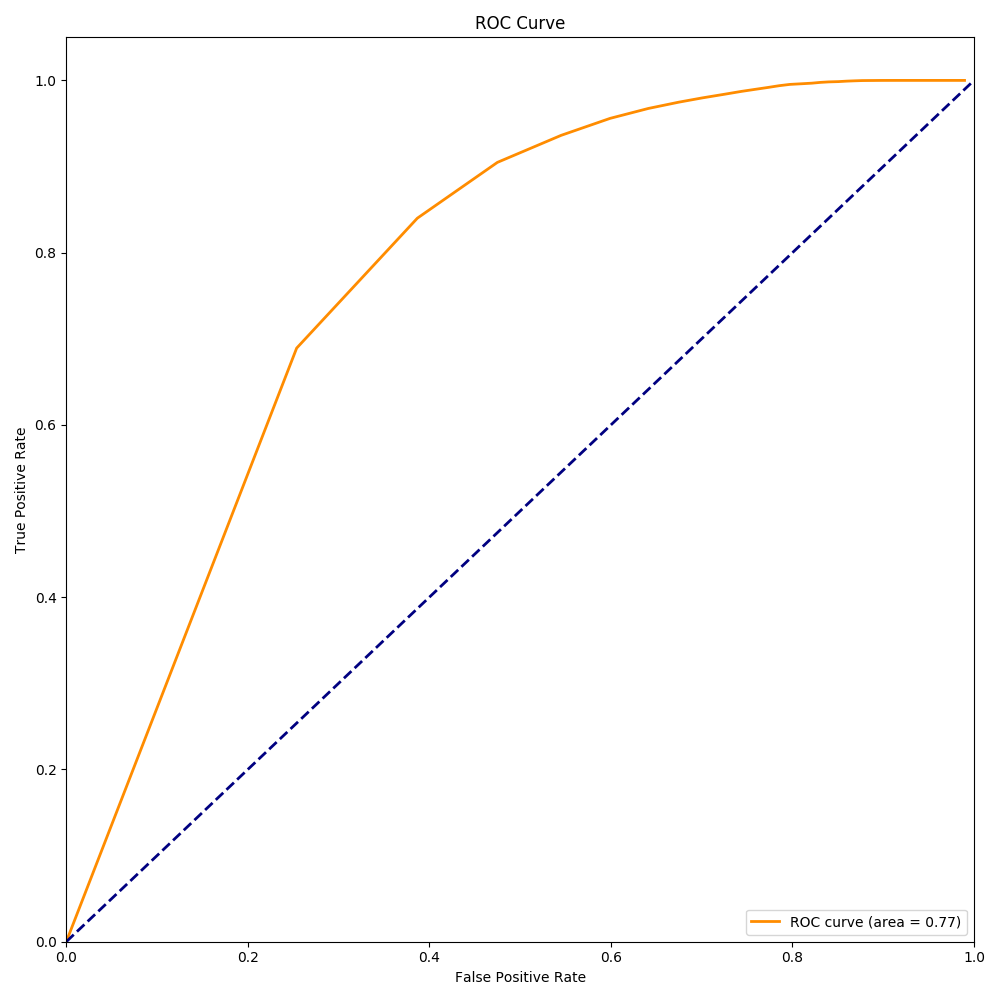

<h1 align="center">Welcome to movie_recommand</h1>

  

> Movie recommendation algorithm based on user scoring

This program achieve a course assignment.

Link prediction algorithms based on network structure are widely used in information recommendation systems. The algorithm does not consider the content characteristics of users and products, regards them as abstract nodes, and constructs a bipartite graph by using the user's choice of products. Evaluate users' potential consumption trends by evaluating products they have never looked at.

MovieLens is the oldest recommendation system. Founded by the GroupLens project team at the School of Computer Science and Engineering at the University of Minnesota, the United States is a non-commercial, research-oriented experimental site. MovieLens primarily uses Collaborative Filtering and Association Rules to recommend users to movies they are interested in.

Https://grouplens.org/datasets/movielens/

Dataset: ml-latest-small.zip includes 700 users rating 100,000 reviews of 9000 movies.

And this is the result of roc.

  

## Install

This program is based on python3.7 with numpy,pandas,sklearn and matplotlib

## Author

👤 **rain**

## Show your support

Give a ⭐️ if this project helped you!

***
